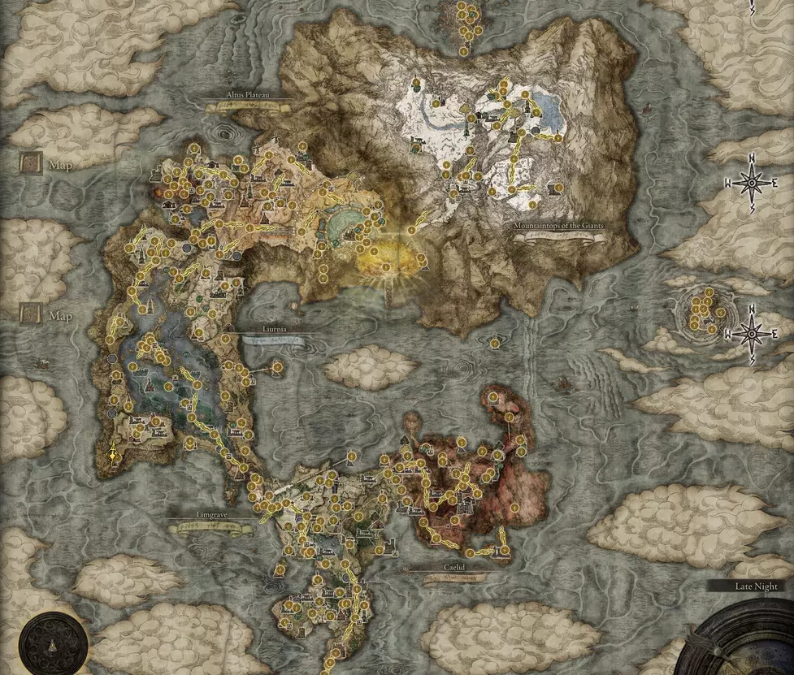

###### Készítette: Nagy Gergely
###### Neptun Kód: B5FUO9 
# *Elden Ring*

Az **Elden Ring** egy 2022-es akció-szerepjáték, amelyet a FromSoftware fejlesztett. A játékot **Hidetaka Miyazaki** rendezte, a világépítést **George R. R. Martin** fantasy író biztosította.
 
 ---

### Megjelenés
> Pontos megjelenési dátuma : 2022. február 25.
 - PC *(Windows)*
 - Playstation
    - *Playstation 4*
    - *Playstation 5*
 - Xbox
    - *Xbox One*
    - *Xbox Series S/X*

 ---
 ### Játékmenet
Az Elden Ring harmadik személy perspektíváján keresztül kerül bemutatásra; a játékosok szabadon barangolhatnak az interaktív nyitott világban. 

A hat fő területet a játékos karakter **Torrent**[^1]-jének elsődleges utazási módjaként kell bejárni. Lineáris, rejtett kazamaták felfedezhetők, hogy hasznos tárgyakat találjanak. 

#### Főterületek
   1. *Limgrave*

   2. *Liurnia*

   3. *Caelid*

   4. *Mt. Gelmir*

   5. *Leyndell*

   6. *Mountaintops of the Giants*

>A játék teljes térképe

A játékosok többféle *fegyvert* és *varázslatot* használhatnak, beleértve a lopakodó mechanika által lehetővé tett nem közvetlen *elköteleződést* is. A játék világában az ellenőrző pontok gyors utazást tesznek lehetővé, és lehetővé teszik a játékosok tulajdonságaik fejlesztését a rúnák nevű játékbeli pénznem használatával.

[~~Forrás~~](https://en.wikipedia.org/wiki/Elden_Ring)

[^1]: Torrent egy mágikus ló, a játékos társa illetve nyergese.
